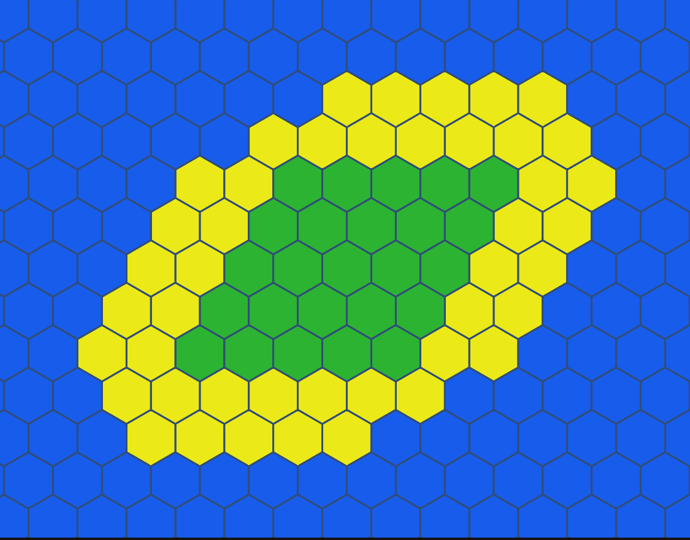

# HexDemo!

This is a Unity/C# demonstration of hexagonal grid generation - an extension on the [ADVENTURE!](https://www.roblox.com/games/6827639179/ADVENTURE) and [Roll-Y](https://www.roblox.com/games/9531912630/roll-y) prototypes. This will eventually be rolled into [my website](https://spelkington.github.io) using Unity's WebGL export tool as a browser demonstration for the Wave Function Collapse procedural generation algorithm.